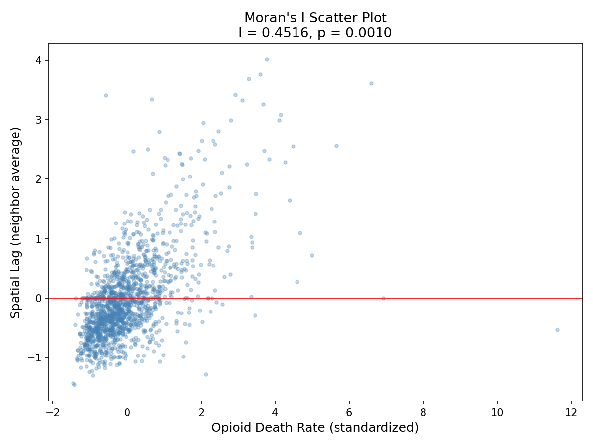
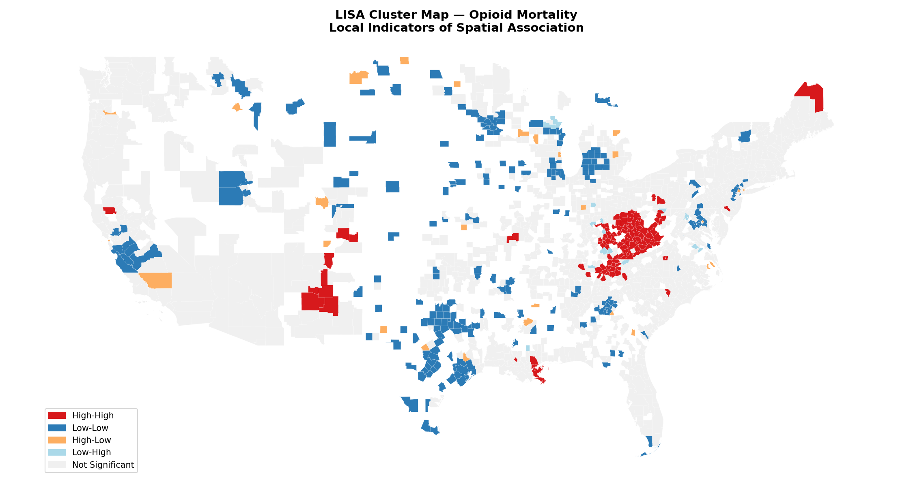
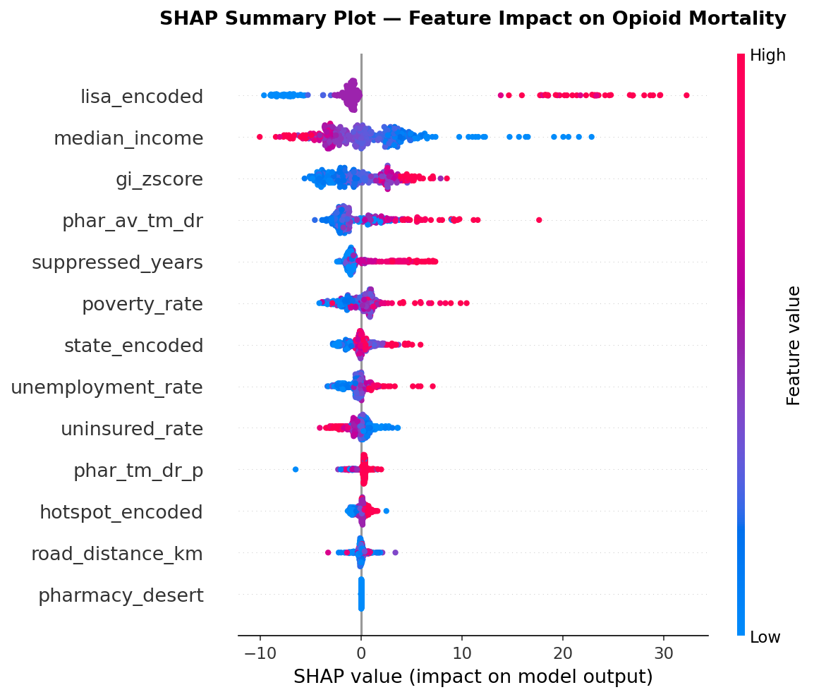
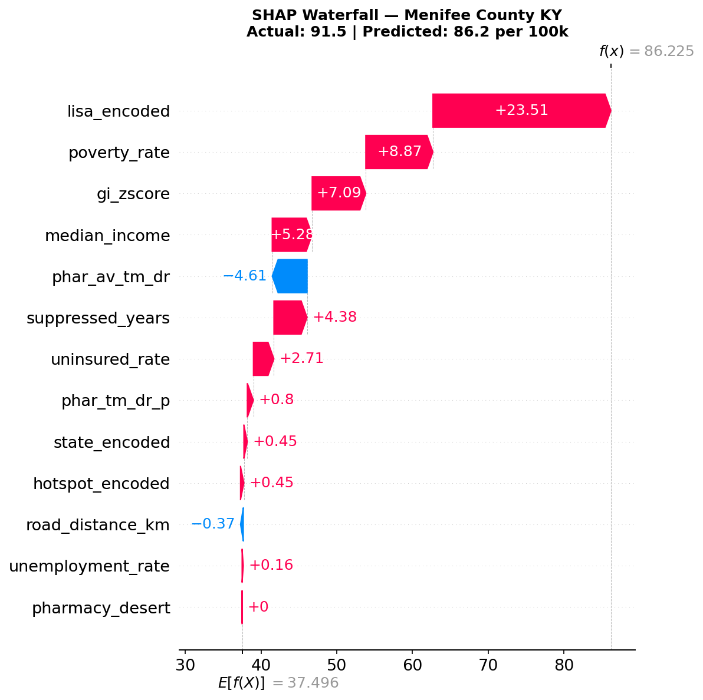
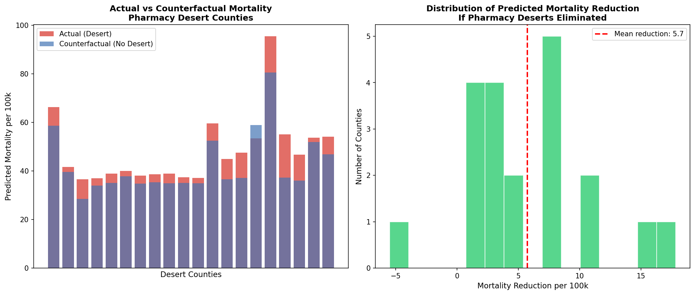

# The Last Mile: Predicting Opioid Mortality in Pharmacy Deserts


## The Question

Do Americans living in pharmacy deserts die from opioid overdoses at higher rates than those with pharmacy access — and can we predict which counties are most at risk?

This project builds an end-to-end spatial machine learning pipeline to answer that question across 3,059 US counties using real CDC, Census, and HRSA data.

---

## Key Findings

| Finding | Value |
|---|---|
| Counties analyzed | 3,059 |
| Counties with mortality data | 1,584 |
| Average opioid mortality | 37.6 per 100,000 |
| Desert county mortality | 48.2 per 100,000 |
| Non-desert county mortality | 37.6 per 100,000 |
| Mortality uplift in deserts | 28.7% higher |
| Spatial clustering (Moran's I) | 0.45, p < 0.001 |
| Hot spot counties (99% confidence) | 432 |
| XGBoost R² | 0.52 |
| Top predictive feature | Spatial cluster type (LISA) |
| Counterfactual mortality reduction | 5.7 per 100,000 if deserts eliminated |

---

## The Surprising Finding

Spatial clustering and poverty are stronger predictors of opioid mortality than pharmacy access alone. SHAP analysis revealed that a county's LISA cluster classification — whether it sits in a High-High mortality cluster — contributes 23.5 deaths per 100k to the prediction, compared to near-zero contribution from the pharmacy desert binary flag.

This suggests the opioid crisis is fundamentally an economic and geographic phenomenon embedded in place, not simply a pharmacy access problem. Eliminating pharmacy deserts without addressing underlying poverty and spatial contagion would have limited impact.

---

## Tech Stack

```
Data Engineering  : Python, Pandas, MySQL
Spatial Analysis  : GeoPandas, PySAL, ESDA, ArcGIS Online
Road Networks     : OSMnx, NetworkX (run on UIUC HPC)
Machine Learning  : XGBoost, Scikit-learn, SHAP
Visualization     : Matplotlib, Seaborn, Tableau Desktop
Database          : MySQL 8.0 (4 tables, 18,738 rows)
```

---

## Data Sources

| Source | Description | Records |
|---|---|---|
| CDC Wonder | County opioid overdose deaths 2018-2024 | 18,738 |
| OEPS (HeRoP Lab) | Pharmacy access metrics by county and tract | 3,234 counties |
| Census ACS DP03 | Socioeconomic indicators | 3,220 counties |
| HRSA | Pharmacy locations with coordinates | 40,135 pharmacies |

---

## Project Structure

```
last-mile-project/
├── notebooks/
│   ├── 01_data_cleaning.ipynb      # CDC, OEPS, Census cleaning
│   ├── 02_eda.ipynb                # EDA and feature engineering
│   ├── 03_mysql_load.ipynb         # MySQL database loading
│   ├── 04_spatial.ipynb            # Moran's I, LISA, ArcGIS merge
│   ├── 05_ml_model.ipynb           # XGBoost, SHAP, counterfactual
│   └── 06_osmnx_hpc.ipynb          # OSMnx road network on HPC
├── sql/
│   └── core_queries.sql            # 3 core analytical SQL queries
├── arcgis/
│   ├── HotSpotsOutput_0.csv        # Getis-Ord Gi* results
│   └── last_mile_counties.zip      # Shapefile for ArcGIS Online
├── outputs/
│   ├── morans_i_scatterplot.png
│   ├── mortality_map.png
│   ├── lisa_cluster_map.png
│   ├── morans_significance_map.png
│   ├── local_morans_intensity_map.png
│   ├── shap_summary.png
│   ├── shap_bar.png
│   ├── shap_waterfall.png
│   ├── counterfactual_analysis.png
│   ├── arcgis_hotspot_map.png
│   └── osmnx_bacon_county.png
└── README.md
```

---

## Methodology

### 1. Data Engineering
Built a normalized MySQL database with 4 tables — counties, overdose_deaths, pharmacy_access, and socioeconomic — joining CDC mortality data with OEPS pharmacy metrics and Census ACS socioeconomic indicators. SQL analysis confirmed pharmacy desert counties have 28.7% higher average opioid mortality than non-desert counties.

### 2. Spatial Autocorrelation
Moran's I test confirmed statistically significant geographic clustering of opioid mortality (I = 0.45, p < 0.001). Local Indicators of Spatial Association (LISA) identified 126 High-High cluster counties concentrated in the Appalachian corridor spanning West Virginia, Kentucky, and Ohio. Getis-Ord Gi* hot spot analysis in ArcGIS Online confirmed 432 counties at 99% confidence as statistically significant mortality hot spots.

### 3. Road Network Distance
Calculated real driving distance from each county centroid to its nearest pharmacy using OSMnx road network analysis run on UIUC's HPC cluster. Processed 1,584 counties against 40,135 pharmacy locations using a two-step haversine pre-filter and Dijkstra shortest path algorithm. Average nearest pharmacy distance: 10.8 km by road.

### 4. Machine Learning
Trained an XGBoost regressor on 12 features including socioeconomic indicators, pharmacy access metrics, spatial cluster classifications, ArcGIS hot spot scores, and OSMnx road distance. Model explains 52% of variance in county opioid mortality (R² = 0.52, RMSE = 13.35 per 100k).

### 5. SHAP Explainability
SHAP analysis revealed spatial cluster type (LISA classification) as the dominant predictor, contributing an average of 4.5 units of impact — nearly double the contribution of median income (3.5 units). Pharmacy desert binary flag and road distance contributed near-zero impact, suggesting geographic embeddedness matters more than pharmacy proximity alone.

### 6. Counterfactual Analysis
Simulated elimination of all pharmacy deserts by setting desert counties to non-desert pharmacy access levels. Model predicted 5.7 deaths per 100k reduction on average — approximately 2 lives per county per year across 20 desert counties in the analytical sample. Results held with 95% of desert counties showing predicted mortality reduction.

---

## Spatial Analysis Results

**Moran's I Scatter Plot**



**LISA Cluster Map**



**ArcGIS Hot Spot Analysis**


---

## ML Results

**SHAP Feature Importance**



**SHAP Waterfall — Menifee County KY**



**Counterfactual Analysis**



---

## MySQL Schema

```sql
counties        (county_fips PK, county_name, state_fips)
overdose_deaths (id PK, county_fips FK, year, deaths, 
                 population, crude_rate, is_suppressed)
pharmacy_access (county_fips PK FK, tot_tracts, phar_ct_tm_dr,
                 phar_tm_dr_p, phar_av_tm_dr, pharmacy_desert)
socioeconomic   (county_fips PK FK, unemployment_rate, 
                 median_income, uninsured_rate, poverty_rate)
```

---

## Key SQL Finding

```sql
SELECT 
    p.pharmacy_desert,
    COUNT(*) as county_count,
    ROUND(AVG(s.poverty_rate), 2) as avg_poverty_rate,
    ROUND(AVG(s.median_income), 0) as avg_median_income,
    ROUND(AVG(o.crude_rate), 2) as avg_crude_rate
FROM counties c
JOIN pharmacy_access p ON c.county_fips = p.county_fips
JOIN socioeconomic s ON c.county_fips = s.county_fips
JOIN overdose_deaths o ON c.county_fips = o.county_fips
GROUP BY p.pharmacy_desert;
```

Result:
```
pharmacy_desert | county_count | avg_poverty_rate | avg_median_income | avg_crude_rate
0               | 17,884       | 14.32            | 66,781            | 35.28
1               | 779          | 16.23            | 62,503            | 52.57
```

---

## Limitations

CDC suppresses death counts for counties with fewer than 10 annual deaths, resulting in 1,475 counties with missing mortality data. The model was trained on the remaining 1,584 counties. Counterfactual estimates assume all other county characteristics remain constant — they represent the direct pharmacy access effect holding socioeconomic conditions fixed, not a full causal estimate.

---

## Author

**Mallikarjun Bhusnoor**
MS Information Management, University of Illinois Urbana-Champaign

---

## Acknowledgments

Pharmacy access data sourced from the Healthy Regions and Policies Lab (HeRoP) Open Equity Platform for Spatial Analysis (OEPS). Mortality data from CDC Wonder. Socioeconomic data from US Census Bureau American Community Survey.
